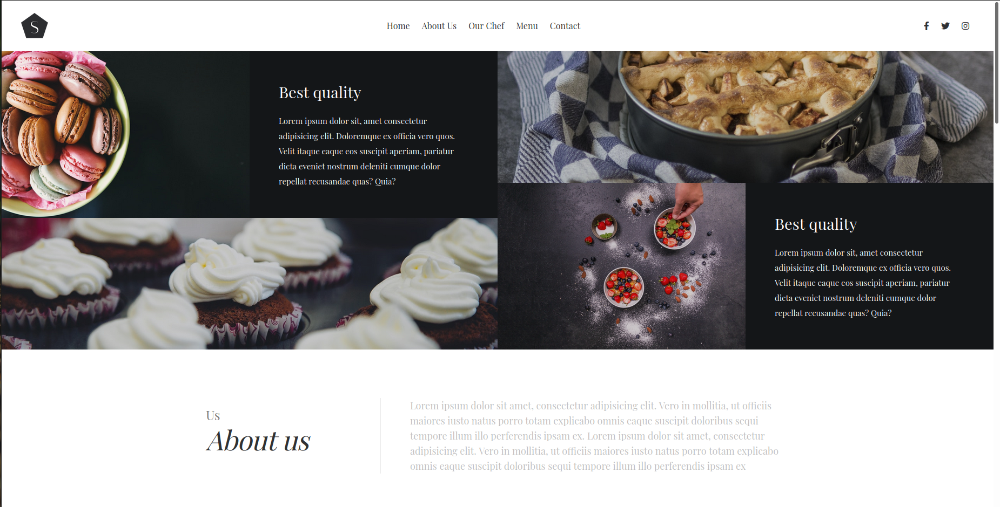
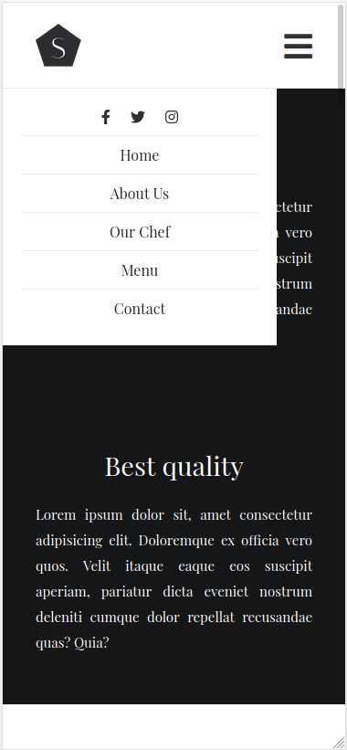

# Coffe and Cake

> A simple fornt end for a basic coffee shop!!!

   
   
   
   
   
   <imd src="https://img.shields.io/badge/Sass-CC6699?style=for-the-badge&logo=sass&logoColor=white">

## Live Version

[coffee Shop live](https://widzthedvloper.github.io/Practice_js/)
## Pages

## Prerequisites

- JavaScript
- jsx
- React
- Code Editor(VScode)

## Usage

1. Clone the repository by using the `git clone git@github.com:widzthedvloper/Practice_js.git` command in your terminal
2. `cd` into the cloned repository
3. Open the the folder in the code editer of your choice :)
4. Open the index.html file in your favorite browser

## Contributing

This project is for educational purposes.

## Acknowledgment

- Sergio Agamez
- Crehana

👤 **Widzmarc Jean Nesly Phelle**

- GitHub: [@widzthedvloper](https://github.com/widzthedvloper)
- Twitter - [@widzthedvloper](https://twitter.com/widzthedvloper)
- LinkedIn: [@widzthedvloper](https://www.linkedin.com/in/widzmarc-jean-nesly-phelle-252a26129/)

### Show your support

Give a ⭐️ if you like this project!

## License

MIT License
